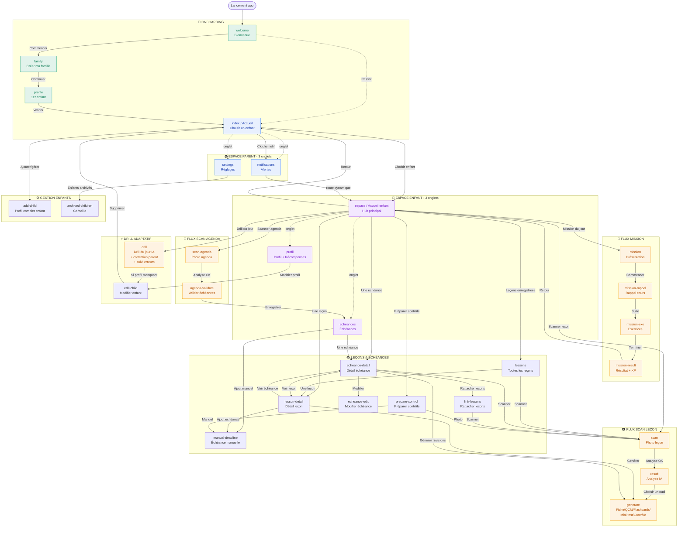

# 🗺️ Architecture de navigation — PROF PARENT IA

> Cartographie complète des écrans et de leurs liens.
> Le diagramme ci-dessous est au format **Mermaid** : il se rend visuellement sur GitHub,
> dans Notion, Obsidian, VS Code (extension Mermaid), et la plupart des outils de design.
> Vous pouvez aussi le coller dans https://mermaid.live pour l'éditer visuellement.

---

## 1. Vue d'ensemble — 3 niveaux de navigation

L'application est organisée en **3 zones** :

| Zone | Dossier | Rôle |
|---|---|---|
| **Onboarding** | `(onboarding)` | Premier lancement : créer la famille + 1er enfant |
| **Espace parent** | `(tabs)` | Accueil parent — choisir un enfant, alertes, réglages |
| **Espace enfant** | `(child-tabs)` | Tout le scolaire d'un enfant (scan, drills, échéances…) |
| **Écrans modaux** | `app/*.tsx` | Écrans ouverts par-dessus (scan, génération, détails…) |

**Règle de sécurité importante** : toutes les actions scolaires (scan, drill, génération) vivent **uniquement dans l'espace enfant**, jamais sur l'accueil parent.

---

## 2. Diagramme de navigation complet

---

## 3. Détail écran par écran (boutons → destinations)

### 🚀 ONBOARDING

#### `welcome` — Écran de bienvenue
| Bouton | Va vers |
|---|---|
| Commencer | `family` |
| Passer / J'ai déjà un compte | `(tabs)` Accueil parent |

#### `family` — Créer ma famille
| Bouton | Va vers |
|---|---|
| ← Retour | Écran précédent |
| Continuer (sauve le nom de famille) | `profile` |
| Ajouter un enfant | `profile` |

#### `profile` — Premier enfant
| Bouton | Va vers |
|---|---|
| ← Retour | Écran précédent |
| Valider | `(tabs)` Accueil parent (remplace l'historique) |

---

### 🏠 ESPACE PARENT (3 onglets)

#### `index` — Accueil parent (choisir un enfant)
| Bouton | Va vers |
|---|---|
| Carte enfant | `(child-tabs)/espace` (espace de l'enfant) |
| 🔔 Cloche notifications | `(tabs)/notifications` |
| Ajouter / gérer les enfants | `add-child` |

#### `notifications` — Alertes
| Bouton | Va vers |
|---|---|
| ← Retour | Écran précédent |
| Une alerte | Route dynamique (souvent l'espace enfant concerné) |

#### `settings` — Réglages
| Bouton | Va vers |
|---|---|
| Enfants archivés | `archived-children` |
| _(Clé API Claude se saisit ici)_ | — |

---

### 👦 ESPACE ENFANT (3 onglets)

#### `espace` — Accueil enfant (hub central) ⭐
| Bouton | Va vers |
|---|---|
| ← Retour aux enfants | `(tabs)` Accueil parent |
| 👤 Profil | `(child-tabs)/profil` |
| Mission du jour | `mission` |
| **Drill du jour** ⚡ | `drill` |
| Scanner une leçon | `scan` |
| Scanner l'agenda | `scan-agenda` |
| Préparer un contrôle | `prepare-control` |
| Révisions | `(child-tabs)/plan` |
| Planning | `(child-tabs)/echeances` |
| Une échéance / contrôle | `echeance-detail?id=…` |
| Rattacher des leçons | `link-lessons?echeanceId=…` |
| Voir toutes les leçons | `lessons` |
| Une leçon | `lesson-detail?id=…` |

#### `echeances` — Échéances
| Bouton | Va vers |
|---|---|
| Une échéance | `echeance-detail?id=…` |
| Ajouter manuellement | `manual-deadline` |

#### `profil` — Profil + Récompenses 🏅
| Bouton | Va vers |
|---|---|
| Modifier le profil | `edit-child` |
| _(Badges, XP, streak affichés ici)_ | — |

---

### 📷 FLUX SCAN LEÇON

#### `scan` → `result` → `generate`
| Écran | Bouton | Va vers |
|---|---|---|
| `scan` | Analyse réussie (+10 XP) | `result?lessonId=…` |
| `result` | Choisir un outil (fiche/QCM/…) | `generate?kind=…&lessonId=…` |
| `generate` | Régénérer | reste sur `generate` |
| `generate` | Scanner une autre leçon | `scan` |

**Les 6 outils de `generate`** : fiche de révision, flashcards, exercices, mini-test, contrôle blanc, planning. (XP gagnés à chaque génération.)

---

### 📅 FLUX SCAN AGENDA

#### `scan-agenda` → `agenda-validate`
| Écran | Bouton | Va vers |
|---|---|---|
| `scan-agenda` | Analyse réussie | `agenda-validate` |
| `agenda-validate` | Enregistrer les échéances | `(child-tabs)/echeances` |

---

### 🎯 FLUX MISSION

#### `mission` → `mission-rappel` → `mission-exo` → `mission-result`
| Écran | Bouton | Va vers |
|---|---|---|
| `mission` | Commencer | `mission-rappel` |
| `mission-rappel` | Suite | `mission-exo` |
| `mission-exo` | Terminer | `mission-result` |
| `mission-result` | Retour | `(child-tabs)/espace` |

---

### 📚 LEÇONS & ÉCHÉANCES (écrans liés)

#### `lesson-detail` — Détail d'une leçon
| Bouton | Va vers |
|---|---|
| Générer (fiche/QCM/…) | `generate?kind=…&lessonId=…` |
| Voir une échéance liée | `echeance-detail?id=…` |
| Ajouter une échéance | `manual-deadline` |

#### `echeance-detail` — Détail d'une échéance ⭐
| Bouton | Va vers |
|---|---|
| Modifier | `echeance-edit?id=…` |
| Générer des révisions | `generate?kind=…&echeanceId=…` |
| Rattacher des leçons | `link-lessons?echeanceId=…` |
| Voir une leçon | `lesson-detail?id=…` |
| Scanner | `scan` |

#### `prepare-control` — Préparer un contrôle
| Bouton | Va vers |
|---|---|
| Saisie manuelle | `manual-deadline` |
| Par photo | `scan` |

---

### ⚡ DRILL ADAPTATIF

#### `drill` — Drill quotidien généré par l'IA
| Élément | Comportement |
|---|---|
| Générer le drill du jour | IA + profil + règles d'adaptation (3 échecs → plus facile, 90% → plus dur) |
| Afficher la correction parent | Masquée par défaut, dépliable par exercice, avec phrase-guide parent |
| ✓ Réussi / ✗ Erreur | Enregistre le résultat ; si Erreur → chips de type d'erreur (calcul, méthode…) |
| Version imprimable | PDF sobre 2 pages : feuille élève + feuille correction (expo-print) |
| Séances précédentes | Historique dépliable : date, score, durée, liste des exercices |
| Terminer la séance | Score + XP, sauve la session et les résultats par compétence |
| _(Si profil incomplet)_ | Propose `edit-child` |

### 📖 CARNET DE LECTURE

#### `lecture` — Suivi de lecture avec questions IA
| Élément | Comportement |
|---|---|
| Formulaire séance | Œuvre, auteur, pages lues, résumé de l'enfant, impression |
| Générer les questions | 4 questions sur les pages lues UNIQUEMENT + 4 mots de vocabulaire + 1 question orale |
| Réponse modèle (parent) | Masquée par défaut, réservée au parent |
| Historique | Séances précédentes dépliables, suppression possible |

---

### ⚙️ GESTION DES ENFANTS

#### `add-child` — Création profil complet
Formulaire : prénom, date de naissance (+ détection classe théorique), établissement, classe, matières, niveau estimé, objectif, durée quotidienne, rythme, ton, points faibles/forts, note libre IA. → Retour à l'accueil après validation.

#### `edit-child` — Modifier un enfant
| Bouton | Va vers |
|---|---|
| Supprimer définitivement | `(tabs)` Accueil parent |

#### `archived-children` — Corbeille
Restaurer ou supprimer définitivement les enfants archivés. ← Retour.

---

## 4. Écrans hérités / non reliés (legacy)

✅ **Nettoyage effectué** : les 15 écrans legacy (anciens onglets parent, flux plan,
écrans de démo coming-soon/photo-floue/validation/mock-test/pdf/correction/progress/
agenda-results/plan-create/plan-edit, doublon notifications racine) ont été supprimés.
Tous les écrans restants sont actifs et reliés.

---

## 5. Résumé des "hubs" (écrans centraux)

Si vous redessinez l'app, concentrez-vous sur ces **4 écrans pivots** :

1. **`(tabs)/index`** — Accueil parent : point d'entrée, choix de l'enfant
2. **`(child-tabs)/espace`** — Accueil enfant : 12+ liens, le vrai centre névralgique
3. **`echeance-detail`** — Détail échéance : carrefour scan ↔ leçons ↔ génération
4. **`generate`** — Génération IA : la sortie de tous les flux de contenu

Tout le reste gravite autour de ces 4 écrans.
